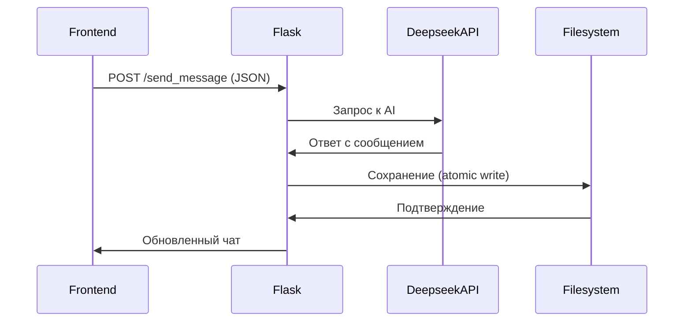

# DeepSeek Chat Interface

**Локальный клиент для Deepseek API с полной историей диалогов**  
🚀 Реализован за 3 дня при парном программировании с DeepSeek Web

## 🤖 Технические детали совместной разработки

### Совместный процесс работы:
1. **Итеративная разработка**:
   - Пошаговая реализация функций через чат
   - Мгновенная обратная связь по архитектуре
   - Совместная отладка в реальном времени

2. **Ключевые точки интеграции**:
   ```python
   # Пример совместно разработанного кода
   def save_conversation():
       try:
           # Динамическое имя файла (совместная оптимизация)
           filename = generate_chat_name(messages)
           # Механизм атомарного сохранения (предложен DeepSeek)
           with open(filepath, 'w', encoding='utf-8') as f:
               json.dump({
                   'meta': {'name': name, 'created': datetime.now().isoformat()},
                   'messages': messages
               }, f, indent=2, ensure_ascii=False)
   ```

3. **Оптимизации от DeepSeek**:
   - Делегирование событий для динамических элементов
   - Система временных ID для новых чатов
   - Автоматическое восстановление после ошибок

### Требования (`requirements.txt`):
```text
flask==3.0.2
openai==1.12.0
python-dotenv==1.0.0
markdown==3.5.2
python-dateutil==2.8.2
```

Установите зависимости:
```bash
pip install -r requirements.txt
```

## 🛠 Архитектурные решения



## 🔧 Типичный рабочий процесс

1. **Начало сессии**:
   ```javascript
   // Инициализация (совместно разработанный код)
   class ChatApp {
     constructor() {
       this.currentChat = {
         id: 'tmp-' + Date.now(),
         isNew: true
       }
     }
   }
   ```

2. **Обработка ошибок** (реализовано с DeepSeek):
   ```python
   @app.errorhandler(500)
   def handle_errors(e):
       logger.error(f"Ошибка: {str(e)}")
       return jsonify({'status': 'error', 'message': str(e)}), 500
   ```
## Скрин


